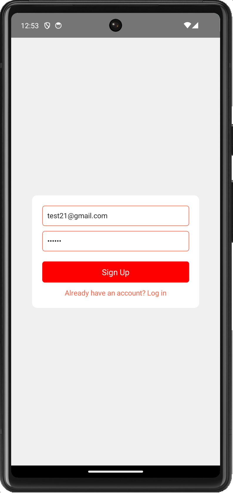
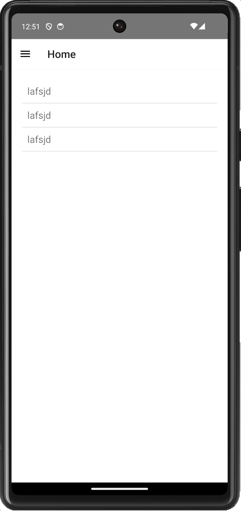
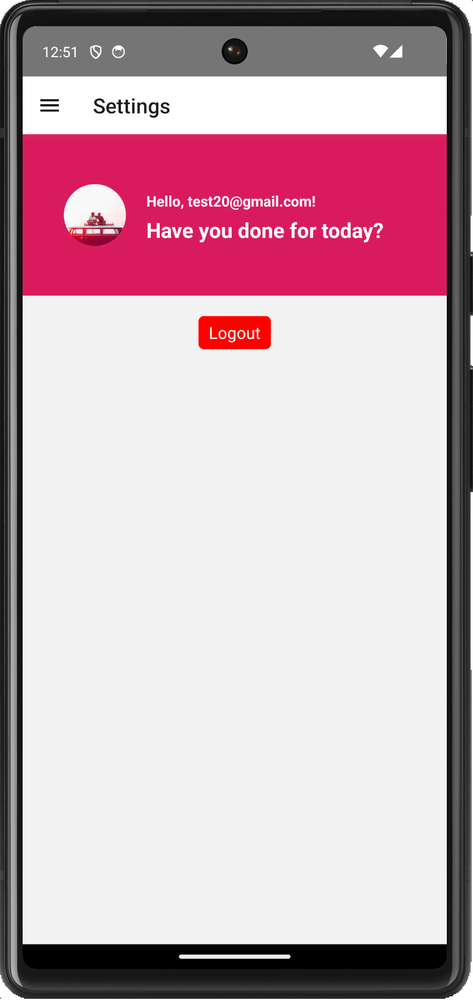

# Getting Started

to-do app user credentials
user name: test@gmail.com
password: 000000

and you may create any user to check with your email address

repo name : https://github.com/NA-Siddiky/todo-app
Branch name: main

## Step 1:

Clone the repository: git clone https://github.com/NA-Siddiky/todo-app
&
pull repo command: git pull

## Step 2:

to build command> npm install

## Step 3:

to run command> npm run start

## 1. Login Screen

## 2. Drawer Navigator Screen

## 3. Home Screen

## 3. Task Screen

## 3. Logout Screen

