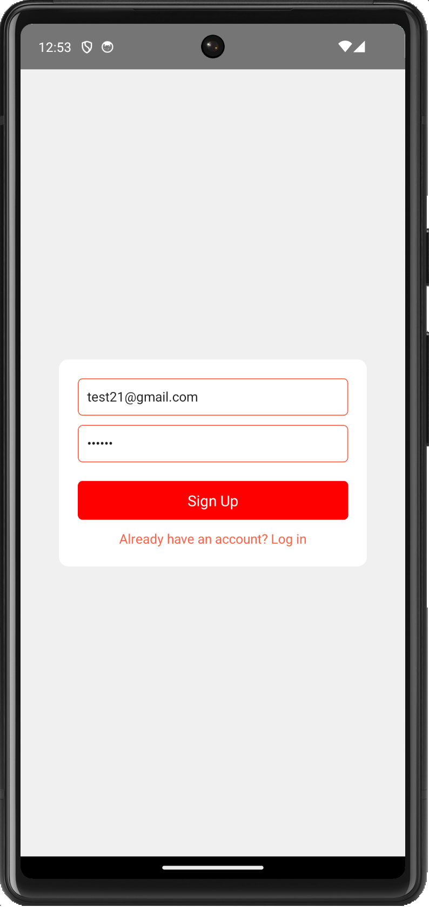
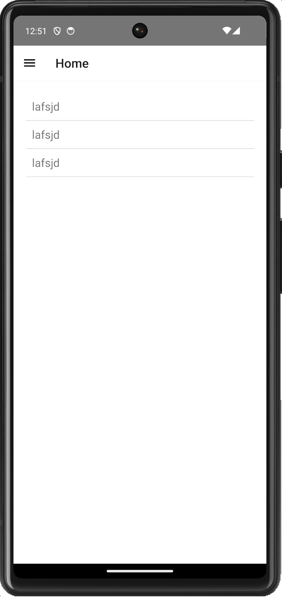
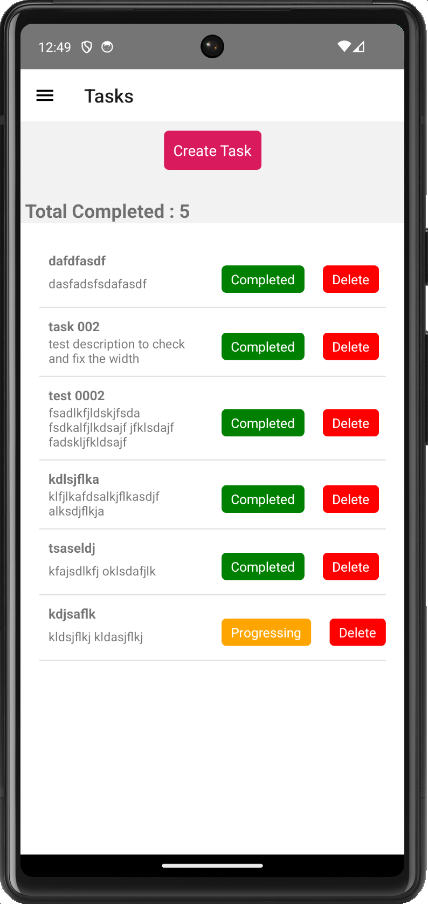
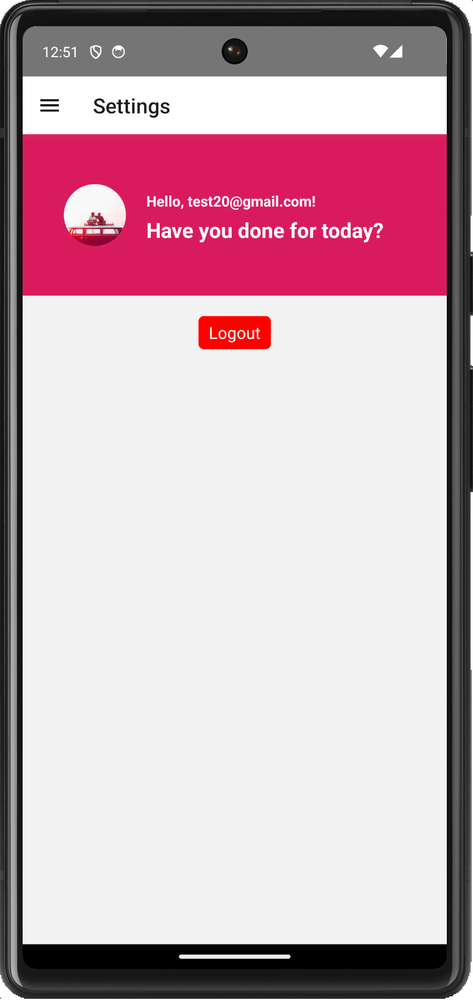

# To-Do App

Welcome to the To-Do App! This application is designed to help you manage your tasks efficiently.

## Table of Contents

- [Prerequisites](#prerequisites)
- [User Credentials](#user-credentials)
- [Repository Information](#repository-information)
- [Backend Information](#backend-information)
- [Installation](#installation)
- [Application Screenshots](#application-screenshots)
- [Contributing](#contributing)
- [License](#license)

### Prerequisites

Before you begin, ensure you have the following:

- A GitHub account
- Node.js (latest) and npm installed on your machine
- Android Studio (latest) installed on your machine

### User Credentials

You can use the following credentials to log in:

- Username: `test@gmail.com`
- Password: `000000`

Alternatively, you can create a new user with your email address.

### Repository Information

- Repository URL: [https://github.com/NA-Siddiky/todo-app](https://github.com/NA-Siddiky/todo-app)
- Branch name: `main`

### Backend Information

The backend is deployed on AWS. You can also use it locally:

- AWS Link: [http://43.201.65.252/tasks/](http://43.201.65.252/)
- Local Link: [http://localhost:5010/](http://localhost:5010/)

### Installation

1. **Clone the Repository**

   Clone the repository to your local machine using the following command:

   git clone https://github.com/NA-Siddiky/todo-app

2. **Pull the Latest Changes**

   Ensure you have the latest version of the repository by pulling the changes:

   git pull

3. **Install Dependencies**

   Navigate to the project directory and install the necessary dependencies:
   
   npm install

4. **Run the Application**

   Start the application by running:

    npm run start

### Application Screenshots

Here are some screenshots of the application:

#### 1. Login Screen

#### 2. Drawer Navigator Screen

#### 3. Home Screen

#### 4. Task Screen

#### 5. Logout Screen

## Thank you
